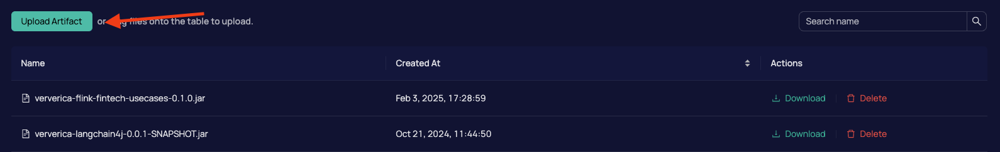
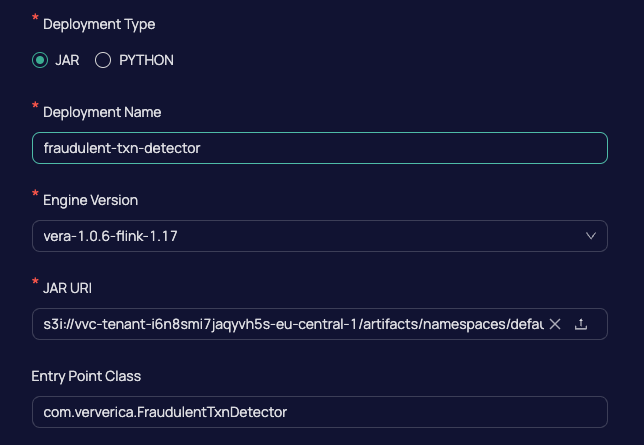
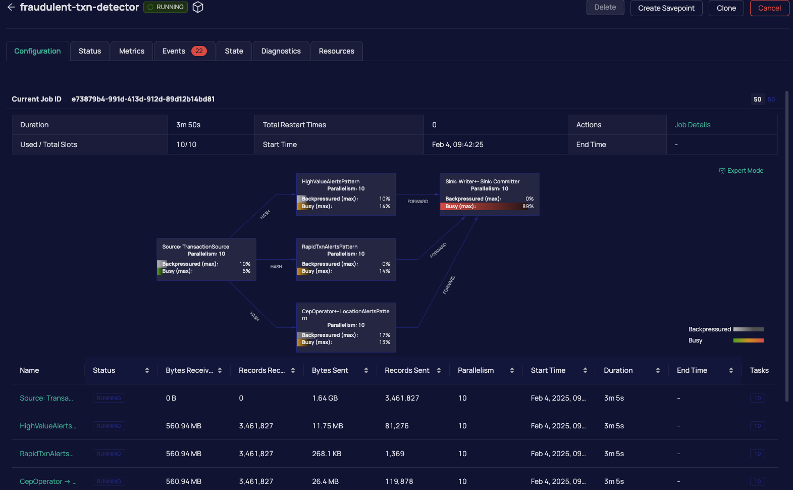
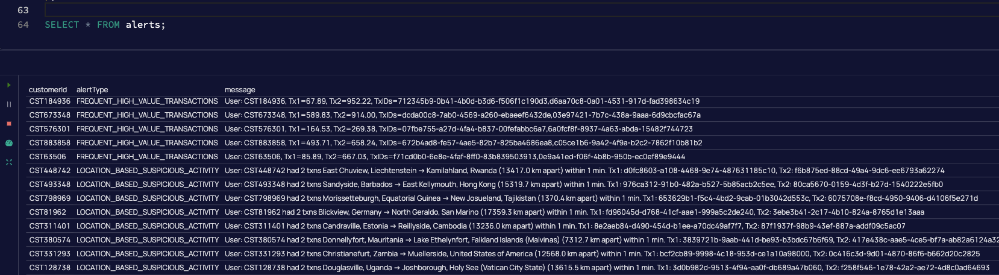

# FinTech Fraud Detection with Apache Flink & CEP on Ververica

    

This repository contains sample code demonstrating **Complex Event Processing (CEP)** with **Apache Flink** on streaming financial transactions with [Ververica](https://www.ververica.com/). 
By **keying** transactions by user, the CEP job automatically ensures that all matched events in a pattern belong to the same user. 
The code showcases how to detect:

✅ **High-Value Consecutive Transactions**

✅ **Multiple Rapid Transactions**

✅ **Location-Based Suspicious Activity**

## Overview

Financial transactions are generated using **Java Faker**, which provides randomized user data such as names, merchants, amounts, and locations. The transactions then flow through a Flink data stream to a series of **CEP patterns**:

- **High-Value Consecutive Transactions**  
  Pattern of two consecutive transactions exceeding a certain threshold (e.g., >900) within 30 seconds.

- **Multiple Rapid Transactions**  
  Pattern of three transactions within a short time window (e.g., 10 seconds).

- **Location-Based Suspicious Activity**  
  Pattern of two transactions in widely **different geographic locations** (e.g., more than 500 km apart) within 1 minute.

By using `keyBy(userId)`, we ensure these patterns apply **per user**, so any sequence that matches comes from a single user. 

### Sample Data Generation

- **`Transaction.java`**  
  Defines the data model for financial transactions, including user ID, timestamp, amount, merchant, and location details.

- **`DataGenerator.java`**  
  Uses [**javafaker**](https://github.com/DiUS/java-faker) to create realistic synthetic transaction data with random amounts, currency codes, merchants, and geolocation.

- **`TxnProducer.java`**
Generates transactions and sends them to a Kafka topic. Make sure to fill in the required properties for `bootstrap.servers` and `sasl.jaas.config` into the `AppConfig.java` file.

### Deployment
Run `mvn clean package` to create a jar file

On the `Artifacts` tab upload the generated jar file

    

Then navigate to the `Deployments` tab, click `new deployment` and put the required fields.

    

Finally click `start` and after a while you will see your job running.

    

### Sample Output

    

